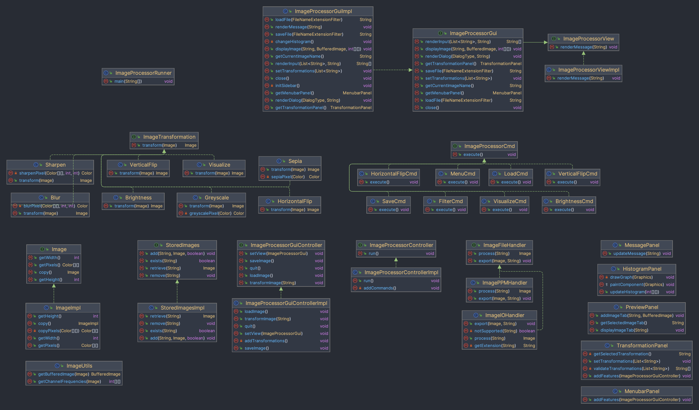

# Image Processor

_Smita Rosemary and Ben Bishop – CS3500 Fall 2022, Northeastern University_

## Overview

This project represents an Image Processor that allows you to manipulate and enhance a given image.

The Image Processor allows a user to load an Image into the program, save it, and apply
transformations such as:

* Visualizing the red, blue, green, alpha, luma, or intensity channels of each pixel in an image as
  a greyscale image
* Vertically or horizontally flipping an image
* Brightening or darkening an image
* Blurring or sharpening an image
* Filtering an image to greyscale or sepia

The user can interact with the program in one of three ways:

1. Via the GUI interface (default - no args needed)
2. Via the command line interface
3. Via a script file

More details on interacting with the program can be found in the [USEME.md](USEME.md) file.

The program currently supports "PPM" images and any image type supported by the Java ImageIO
library. We guarantee support for "PNG", "JPG/JPEG", and "BMP" images. The program will
automatically detect the format to save to/load from based on the file extension.

We have provided two test images located in the `res` folder named `ExampleImage.ppm`
and `ExampleImage2.png`. We have also processed this image with all available commands to visualize
transformations without running the program and saved them to the subfolder `res/processed`
. `ExampleImage.ppm` was created by Smita Rosemary, and has been used with her
permission. `ExampleImage2.png` was created by Ben Bishop, and has been used with his permission.

## How to Use

Instructions on how to use the program can be found in the [USEME.md](USEME.md) file.

## Changelog

### Assignment 6 (11/22/2022)

_Third version. Retained all existing functionality, and added a new view, allowing the user to view
the program graphically rather than through text._

#### Changes

* Added `ImageUtils` class in order to encompass various utility methods used throughout the
  program.
    * `getBufferedImage` method to convert an `Image` to a `BufferedImage`
    * `getChannelFrequencies` method to get the frequency of each color channel in an image
* Added support for a GUI (graphical user interface) mode that allows all functionality to be
  performed without any user interaction via the terminal
    * Added `ImageProcessorGuiImpl` class (implements `ImageProcessorGui`) to represent the new GUI
      view (extends the previously existing `ImageProcessor` interface)
    * Added `ImageProcessorGuiControllerImpl` class (implements `ImageProcessorGuiController`) to
      represent the controller for the GUI view
    * Added various panel classes to represent the various panels in the GUI view. Each panel extend
      various swing component classes to wrap the creation and interaction in simpler public
      methods.
        * `HistogramPanel` class to represent the histogram preview panel
        * `MenubarPanel` class to represent the menu bar
        * `MessagePanel` class to represent the message panel
        * `PreviewPanel` class to represent the image preview panel
        * `TransformationPanel` class to represent the transformation panel
* Removed two methods from the `ImageProcessorView` interface (`renderMenu` and `renderWelcome`)
  and implemented each method's functionality in the `ImageProcessorController` class to make
  extensibility more dynamic. Updated the `ImageProcessorControllerImpl`
  and `ImageProcessorViewImpl` classes to reflect this change.
* Updated the `ImageProcessorRunner` class to support the new GUI view as the default, and modified
  the method of running the program in a text view.

### Assignment 5 (11/10/2022)

_Second version. Retained all existing functionality, and added support for new transformations and
the ability to run from a script file._

#### Changes

* Added support for blurring, sharpening, and applying a sepia or greyscale filter to an image.
    * Added more implementations of the `ImageTransformation` interface in the model (`Blur`
      , `Sharpen`, `Sepia`, and `Greyscale`) to apply these filters to `Image`s.
    * Added a new implementation of the `ImageProcessorCmd` interface in the controller
      (`FilterCmd`) to handle the execution of the `blur`, `sharpen`, `sepia`, and `greyscale`
      commands.
    * Modified the `addCommands` method in the `ImageProcessorControllerImpl` class to add the four
      new commands to the map of supported commands.
    * Updated the `renderMenu` method in the `ImageProcessorViewImpl` to include the new filters in
      the menu.
    * Added new test methods in both the `ImageControllerTest` and `ImageTransformationTest` classes
      to test the new commands.
    * Added new example images in the `res/processed` folder to demonstrate the new filters.
* Added a new higher-resolution example image in the `res` folder (`ExampleImage2.png`) to make
  visualization of the new filters easier.
* Added support for loading and saving images from more conventional file formats
    * Added a new implementation of the `ImageFileHandler` interface in the
      controller (`ImageIOHandler`) to handle loading and saving images using the Java ImageIO
      library. This library supports a wide variety of image formats, including "png", "jpg", "jpeg"
      , and "bmp". These four formats are guaranteed to be supported by the program, but others may
      be as well.
    * Modified the `LoadCmd` and `SaveCmd` classes to check the file format of the image to be
      loaded/saved and use the `ImageIOHandler` if it is not a "ppm" image.
    * Added new test methods in the `ImageControllerTest` class to test loading/saving images using
      the new file formats.
* Added support for loading and running a script file as a command line option.
    * Modified the `ImageProcessorRunner` class to check for the presence of
      the `-script <script text file>` command line option, and fallback to the standard CLI if it
      is not present.
* Updated the test methods in the `ImageProcessorViewImplTest` class to ensure the new menu is
  displayed.
* Added support for running the program from a JAR file (see [USEME.md](USEME.md) for details).
    * Added a new `MANIFEST.MF` file to the `META-INF` folder to specify the main class of the
      program.
    * Built the program into a JAR file located at `res/ImageProcessor.jar`.
* Updated the `README.md` file to include more information about the image processor and the new
  features implemented in this version.
* Created a new `USEME.md` file to document how to use the program.

#### Bug Fixes

* `ImagePPMHandler`
    * Fixed that the `process` method would throw an exception if the file was empty.
    * Fixed that the `process` method did not close scanners it opened.
* `Visualize`
    * Replaced typecasting with rounding in the `transform` method to result in more accurate
      transformations.
* Cleaned up JavaDoc comments to be more consistent and accurate.
* Cleaned up error messages to be more consistent and accurate.

### Assignment 4 (11/4/2022)

_Initial version. Included the following initial features:_

* Use the image processor within the terminal
* Load an image into the program
* Save an image from the program
* Brighten or darken an image
* Flip an image horizontally or vertically
* Visualize the red, blue, green, alpha, luma, or intensity channels of each pixel in an image as a
  greyscale image
* View a menu of commands
* Transform multiple images at once

## Class Diagram

To more easily visualize these classes, we have provided a class diagram below:

## Class Overview

### Controller

* Interfaces
    * `ImageProcessorController` : Represents a controller for the image processor. As the user
      inputs commands, the controller validates the parameters and executes them. The controller
      also handles the exceptions thrown by the model and view, and displays them as messages to the
      user via the view.
        * Implementations:
            * `ImageProcessorControllerImpl`: Implements the `ImageProcessorController` interface
              supporting the above transformation commands as well as `load`, `menu`, and `save`.
    * `ImageProcessorCmd` : Represents a supported command that the image processor can handle. The
      command is executed by calling the `execute` method, and implemented subclasses of this
      interface will handle the execution of the command
        * Implementations:
            * `MenuCmd` : Implements the `ImageProcessorCmd` and represents the `menu` command
              offered by the processor.
            * `LoadCmd` : Implements the `ImageProcessorCmd` and represents the `load` command
              offered by the processor.
            * `SaveCmd` : Implements the `ImageProcessorCmd` and represents the `save` command
              offered by the processor.
            * `BrightnessCmd` : Implements the `ImageProcessorCmd` and represents the `brighten`
              and `darken` command offered by the processor.
            * `HorizontalFlipCmd` : Implements the `ImageProcessorCmd` and represents
              the `horizontal-flip` command offered by the processor.
            * `VerticalFlipCmd` : Implements the `ImageProcessorCmd` and represents
              the `vertical-flip` command offered by the processor.
            * `VisualizeCmd` : Implements the `ImageProcessorCmd` and represents
              the `visualize-<componenet>` command offered by the processor.
            * `FilterCmd` : Implements the `ImageProcessorCmd` and represents the `blur`, `sharpen`
              , `sepia`, and `greyscale` commands offered by the processor.
    * `ImageFileHandler` :  Represents a model used to convert image files into `Image` objects.
        * Implementations:
            * `ImagePPMHandler` : Implements the `ImageFileHandler` interface for converting PPM
              image files into `Image` objects, and vice versa.
            * `ImageIOHandler` : Implements the `ImageFileHandler` interface for converting images
              into `Image` objects using the Java ImageIO library.
    * `ImageProcessorGuiController` : Represents a features interface for the image processor. As
      the user interacts with the program and clicks on features, the controller validates the
      parameters and executes them. It also handles the exceptions thrown by the model.
        * Implementations:
            * `ImageProcessorGuiControllerImpl`: Implements the `ImageProcessorGuiController`
              interface supporting features such as `loadImage`, `removeImage`, `saveImage`, `quit`,
              and `transformImage`.

### Model

* Interfaces
    * `Image` : Represents an image and it's pixels.
        * Implementations:
            * `ImageImpl` : Implements the `Image` interface, each image is represented by a 2D
              array of colors.
    * `ImageTransformation` : Represents a macro that can be applied to an `Image` to transform its
      pixels in some way.
        * Implementations:
            * `Brightness` : Implements the `ImageTransformation` interface and represents a macro
              that adjusts the brightness of an image, both up the scale and down.
            * `HorizontalFlip` : Implements the `ImageTransformation` interface and represents a
              macro that flips an image along the horizontal axis.
            * `VerticalFlip`: Implements the `ImageTransformation` interface and represents a macro
              that flips an image along the vertical axis.
            * `Visualize` : Implements the `ImageTransformation` interface and represents a macro
              that transforms the images to visualize the greyscale image by one of the following
              color components : `Red`, `Blue`, `Green`, `Value`, `Luma`, or `Intensity`.
            * `Blur` : Implements the `ImageTransformation` interface and represents a macro that
              blurs an image.
            * `Sharpen` : Implements the `ImageTransformation` interface and represents a macro that
              sharpens an image.
            * `Sepia` : Implements the `ImageTransformation` interface and represents a macro that
              applies a sepia filter to an image.
            * `Greyscale` : Implements the `ImageTransformation` interface and represents a macro
              that applies a greyscale filter to an image.
    * `StoredImages` : Represents a collection of  `Image`s that have been loaded into the program
      by the user, identified by the image's file name selected by the user.
        * Implementations:
            * `StoredImagesImpl` : Implements the `StoredImages` interface. The stored images are
              represented by a `Map<String, Image>`, the string representing a fileName.
        * `ImageUtils` : Represents a utility class for the model that currently supports two static
          methods – `getBufferedImage` and `getChannelFrequencies`.

### View

* Interfaces
    * `ImageProcessorView` : This interface represents the view of the Image Processor. It contains
      methods that the controller can call to render the view.
        * Implementations:
            * `ImageProcessorViewImpl` : Implements the ImageProcessorView interface and it's
              methods. Handles appending all the messages from the controller to the user.
    * `ImageProcessorGui` : This graphical user interface represents the view of the Image
      Processor. It contains methods that the controller can call to render the view.
        * Implementations:
            * `ImageProcessorGuiImpl` : Implements the ImageProcessorGui interface and it's methods.
              Renders the view graphically and changes it according to the user's interactions.

* Panels - The GUI view is composed of a number of panels, each of which is a separate class that is
  an extension of a Java Swing object. These panels are:
    * `HistogramPanel` : Represents the histogram panel (extends JPanel) that displays the currently
      selected image's histogram chart of R, G, B, and Intensity values.
    * `MenubarPanel` : Represents the menu bar (extends JMenuBar) that is a part of the view,
      displays the program's different menu items such as `Load Image`, `Save Image`,
      and `Quit Program`.
    * `MessagePanel` : Represents the message panel (extends JPanel) that displays messages that do
      not need to be displayed as popups to the user (e.g. success messages).
    * `PreviewPanel` : Represents the preview panel (extends JTabbedPane) that displays all loaded
      images as tabs, and allows the user to scroll around images that are too large to fit in the
      frame.
    * `TransformationPanel` : Represents the transformations panel that displays all the
      transformations that can be applied to an image, with a button to apply the transformation
      currently selected in the list.

### Main Class

* `ImageProcessorRunner` :  Contains the main method which runs the image processor in the terminal
  for the user. The class will parse any command line arguments and use them to initialize the
  controller and view.
