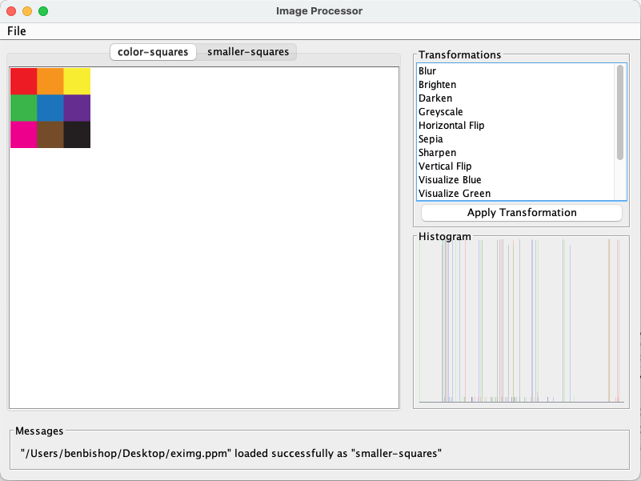

# How to Use the Image Processor

_For a more detailed overview of the program, see the [README.md](README.md) file._

## Overview

The image processor can currently be used in three ways: via a graphical user interface, via the
command line interface, or via an imported script file. The graphical user interface allows users to
perform all functions and transformations without textual input. The command line interface allows
users to enter commands with real-time feedback displayed int the terminal window. The script file
interface makes it easy to run a series of commands in a batch process.

## Supported Commands

The following commands are supported by all three interfaces. The command line interface and the
script file interface use the syntax below:

* "quit" - _quits the program_
* "menu" - _displays the menu of commands_
* "load" <path> <filename> - _loads an image (identified by given name) into the processor  (
  supports ppm, png, jpg, jpeg)_
* "save" <path> <filename> - _saves an image to an output file (supports ppm, png, jpg, jpeg)_
* "visualize-`<component>`" `<filename>` `<new filename>` - _transforms an image to a new greyscale
  image using a chosen component_
    * `<component>` can be "red", "green", "blue", "value", "intensity", or "luma"
* "brighten" `<amount>` `<filename>` `<new filename>` - _transforms an image to a new image
  brightened by an amount_
* "darken" `<amount>` `<filename>` `<new filename>` - _transforms an image to a new image darkened
  by an amount_
* "horizontal-flip" `<filename>` `<new filename>` - _horizontally flips an image to a new image_
* "vertical-flip" `<filename>` `<new filename>` - _vertically flips an image to a new image_
* "blur" `<filename>` `<new filename>` - _transforms an image to a new blurred image_
* "sharpen" `<filename>` `<new filename>` - _transforms an image to a new sharpened image_
* "sepia" `<filename>` `<new filename>` - _transforms an image to a new sepia filtered image_
* "greyscale" `<filename>` `<new filename>` - _transforms an image to a new greyscale filtered
  image_

This functionality is fully supported by the graphical user interface, but the loading/saving of
images and quitting the program is handled by items in the menu bar (File > Load Image, File > Save
Image, File > Quit Program). Once an image is loaded, the user can select the transformation they
want to perform from the list of transformations in the sidebar.

## Graphical User Interface (GUI)

The GUI is the easiest way to use the image processor. It is simple to use and does not require any
interaction with the terminal.

1. Copy the `res/ImageProcessor.jar` file to the directory where you want to run the program.
2. Open a terminal window and navigate to the directory where you copied the file.
3. Enter the command `java -jar ImageProcessor.jar` to run the program.

Upon launch, the user will be able to interact with images using the GUI. Loading an image can be
done via File > Load Image, saving an image can be done via File > Save Image, and once finished,
the user can exit the program via File > Quit Program. All loaded images are showed in the preview
panel, with a new tab for each image. Any transformations can be applied to the image by selecting
the desired transformation from the list of transformations in the sidebar, and the transformation
will be applied to the currently selected image tab, and any information needed will be requested
via a popup form.

### Interface Preview

Here is a preview of what the GUI looks like:

## Command Line Interface

1. Copy the `res/ImageProcessor.jar` file to the directory where you want to run the program.
2. Open a terminal window and navigate to the directory where you copied the file.
3. Enter the command `java -jar ImageProcessor.jar -text` to run the program.

Upon launch, the user will be shown a welcome message, with the option to "quit" the program or view
a "menu" of available commands. After entering a command and hitting the return key, the program
will either display a detailed error message or a success message. The user can enter the
command `quit` at any time to exit the program.

## Script File Interface

A script file is a text file containing a series of commands to be executed by the program. The
script file should only contain supported commands, with one command per line. Extra line breaks can
be added for readability, but will not affect the program's execution.

1. Create a text file with the extension `.txt` in the directory where you want to run the program.
2. Enter the commands you want to execute in the file, one per line.
3. Save the file.
4. Copy the `res/ImageProcessor.jar` file to the same directory.
5. Open a terminal window and navigate to the directory where both files are located.
6. Enter the command `java -jar ImageProcessor.jar -script <script file name>` to run the program.
    * _An example script file is provided in the `res` directory (`example-script.txt`)._
7. The program will execute the commands in the script file, and display the success/failure of each
   command in the terminal window as if you were entering the commands manually.
